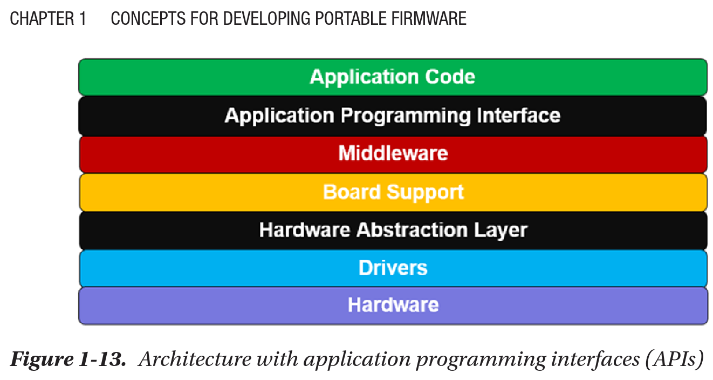

# N3S - Nano-Scale Sub-Systems
- N3S stands for Nano-Scale Sub-Systems. It combines a custom EEPROM Filesystem (NSFS), Display Library (NSD) and Communication Protocol (NSP), along with a CLI tool to interact with the system from Linux PC (NSCLI). (Fun fact: N3S sounds like entrées showing the nature of the project being made of entrée-esque subsystems).
- Project itself is meant for improving my skills in embedded/constrained environment C firmware development, systems engineering, writing portable code and modular software architecture.
- Every subsystem has each of these modular layers below designed and implemented manually (Inspired by the book Reusable Firmware Development by Jacob Beningo).

# NSFS

- NSFS subsystem implements a custom filesystem on an EEPROM with 4 file types. It contains 4 modules that progress in abstraction. modules for slots and files are completely abstracted from hardware specific code and can be ran on any MCU with very few tweaks.

## Statistics
- Efficiently uses 96.9% of raw EEPROM bits meaning minimal waste.
- Lets users access and modify to 89.06% of the raw EEPROM bits.
- Can store files up to 7.296KB in size.
- NSFS allows 256 possible files

## Modules
1. i2c.h
  - Implements basic I2C to accomodate basic Controller-Peripheral communication. Low-level driver.
2. eeprom.h
  - Built over i2c.h, implements convenient EEPROM reading and writing interface. HAL for non volatile memory.
3. slot.h
  - Now completely abstracted from hardware, implements the fundamentals of the NSFS like the Header segment, with metadata and table of 4 sections of slots, and Data segment, mapping offset for data per each slot. Middleware to abstract away hardware completely.
4. file.h
  - Implements actual files and operations over them by representing a single file as an ordered combination of slots from the same section and with the same name. The final API layer.

## File types
- Text file (.t)
  - Read ASCII text
- Executable file (.e)
  - Manipulate GPIO pins with custom timing (e.g. turn LEDs ON/OFF in specific patterns)
- Vector image (.v)
  - Draw vector shapes (Dots, Lines, Rectangles and Triangles)
- Bitmap image (.i)
  - Render bitmap images

# NSD

## Modules

## Shapes and Text

# NSP

# NSCLI
